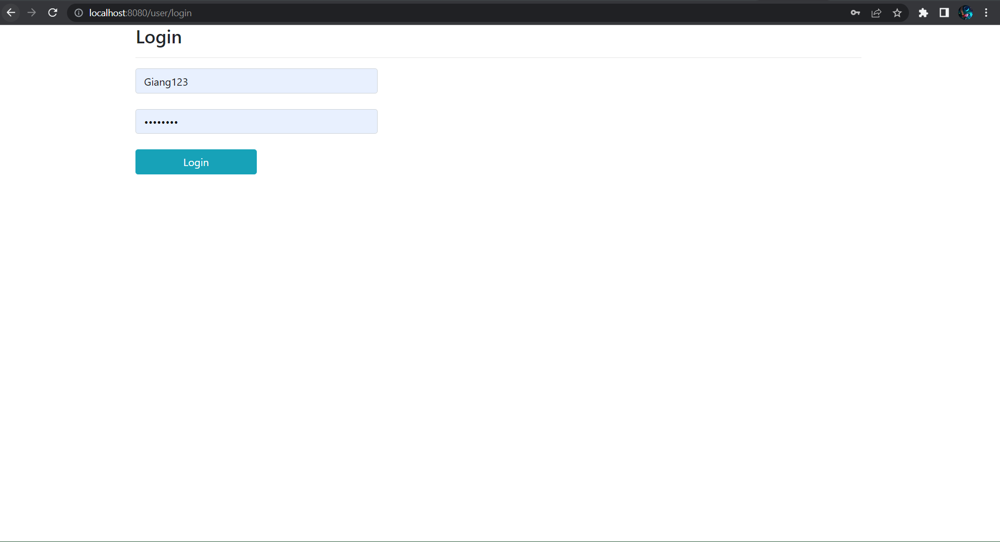

# CommunityPost

# About
This is a website where people can upload their own post and read post shared by other people. It has some basic features such as create, update, delete and read post, check personal and update personal information   

# Usage
## 1. Login

## 2. Home screen 

### 2.1 Your post

### 2.1.2 Add post

### 2.1.3 Read post

### 2.1.4 Update post

### 2.2 Check personal information 

### 2.2.1 Update information

